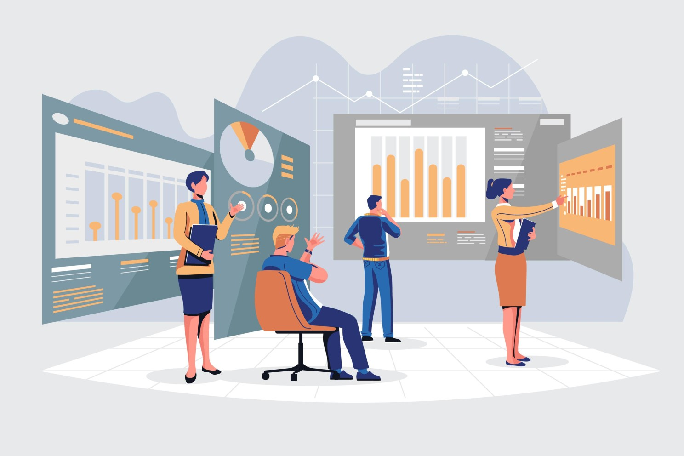

# Süreç Madenciliği Nedir?

Süreç Madenciliği ( **Process Mining**), Süreç Yönetimi ile Veri Madenciliği disiplinlerinin kesişim kümesinde yer alan; görece yeni bir teknolojidir. 
Süreç Madenciliği ile bir organizasyonun iş süreçlerinde yer alan tüm veri analiz edilerek tabir-i caizse organizasyonun iş süreçlerinin DNA'sı ortaya konabilmektedir. Dahası mevcut durumu analiz ederek iyileştirme yolunda varsayımsal hareket etmek yerine somut ve veri odaklı aksiyonlar almamızı sağlar.

**Gartner** SuperApp'i şu şekilde ifade etmiş:

 "**It is more than just a composite mobile app or web portal. Superapps are built as platforms to deliver modular mini-apps that users can activate for personalized app experiences.**"
 
Yani SuperApp'ler sıradan bir mobil uygulama ya da web sitesinden çok daha fazlası. Kendi içinde mini-app'ler barındırarak kullanıcıların ihtiyacı oldugunda mini-app'leri aktive ederek kullanabilmelerine ve ihtiyaçlarını hemen gidermelerini sağlıyor.

Hepimizin kullandığı **Getir** ve **Trendyol** gibi uygulamalar SuperApp konseptine en yakından verebileceğimiz uygulamalar olarak öne çıkmakta. Bu uygulamalar ilk başta bir konu özelinde hayatımıza girdikten sonra sonrasında farklı hizmetleri de bünyesinde sağlayarak aslında kullanıcıların olabildiğince tek bir platform üzerinde hizmet almasını sağladı.

**Super App konsepti iş dünyasına, iş uygulamaları alanına nasıl uyarlanabilir peki?**

Farklı uzmanlıklar ve disiplinler için farklı iş uygulamaları hepimizin malumu... Aslında öyle olmak da zorunda. Zira bir konuda uzman olan bir iş uygulamasının ( ör: Muhasebe ), başka bir konuda (ör: Bakım Yönetimi) uzman olmasını beklemek çok da doğru değil. Ancak bu denli kompleks ihtiyaç ve beklenti gerektirmeyen fakat işletmelerde yoğunlukla kullanılan süreçler için SuperAPP benzeri platformlarda kullanıcıların hızlıca erişim sağlayabileceği mini-app'ler söz konusu olabilir. Kullanıcılar -genellikle- bulut mimarisi üzerinde çalışan bu SuperAPP'ler üzerinde o an ihtiyaç duydukları işlemleri gerçekleştirebilmeli; bunlar için farklı arayüzlere erişim sağlamadan tek bir platformda işini görebilmelidir.

İş uygulamaları alanında gelecekte çok daha fazla ses getireceğini düşündüğüm Business-SuperAPP konsepti sayesinde;

- Çok büyük yatırımlar ve proje maliyetleri gerektirmeden pek çok süreç dijitalleştirilebilecektir.
- SAAS ve PAAS mimarileri sayesinde yazılım geliştirme ve devreye alma süreleri oldukça kısalacaktır.
- İş verimliliği artacak, daha verimli ve efektif iş süreçleri dizayn edilebilecektir.
