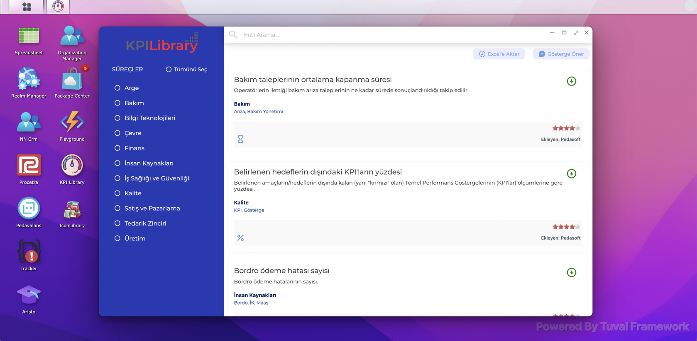
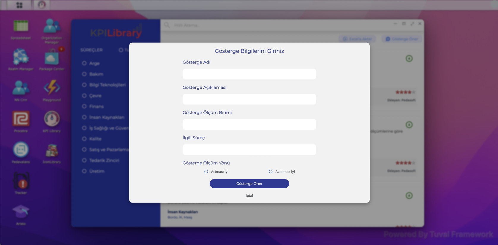
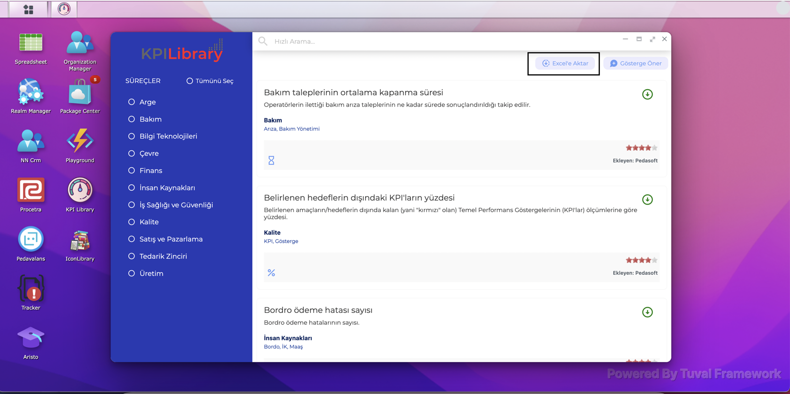

# KPI LIBRARY #

KPI Library, işletmelerde süreç yönetimi çalışmalarında sıklıkla ihtiyaç duyulan bir konuya çözüm bulmak adına geliştirilmiştir. **KPI Library**'de süreç ve sektör bazında
performans göstergelerine erişilebilecek; KPI (Key Performance Indicator) Listeleri oluşturarak **Excel** formatında export edebileceksiniz.

Üstelik **KPI Library**, sizlerin katkıları ile daha da büyüyecek ve her sektörden binlerce kullanıcıya erişebilecek.

## KPI Library Nasıl Kullanılır? ##

http://apps.peda360.com adresinden kullanıcı adı ve şifrenizle giriş sağladıktan sonra **KPI Library** ikonuna tıklayın.

Açılan ekranda kütüphanede tanımlı tüm göstergeler listelenecektir. Sol taraftaki **SÜREÇLER** başlığı altındaki süreç isimleri seçeneklerine tıklandığında ilgili süreçlerle ilişkilendirilmiş göstergeler filtrelenmiş olacaktır.

## KPI Library'e Gösterge Önerme ##

**KPI Library**'de bulunmayan ve kütüphaneye eklemek istediğiniz göstergegeleri **Gösterge Öner** butonuna tıklayarak açılan sayfadan iletebilirsiniz. **Gösterge Öner** butonuna tıklayınca açılan sayfada aşağıdaki bilgileri girerek **Gösterge Öner** butonu tıklanır. Göstergeniz değerlendirildikten sonra listeye eklenecektir.

* **Gösterge Adı:** Göstergenin kısa tanımı/adı.
* **Gösterge Açıklaması:** Göstergenin varsa detaylı olarak ne anlam ifade ettiği, hesaplanma metodu vb bilgiler.
* **Gösterge Ölçüm Birimi:** Göstergenin ölçüm birimi. (Adet, kg, TL, $ gibi.)
* **İlgili Süreç:** Önerilen gösterge hangi iş süreci/süreçleri ile ilgili.(Bakım,Üretim,Satış vb gibi)
* **Gösterge Ölçüm Yönü:** Gösterge değerinin yükselmesi isteniyorsa **Artmasyı iyi**, azaltması isteniyorsa **Azalması İyi** seçeneği seçilir.

## Seçilen Göstergeleri Excel'e Aktarma ##

**KPI Library**'de seçilen filtre kriterlerine göre listelenen göstergeleri Excel'e aktarabilirsiniz. Bunun için **Excel'e Aktar** butonu tıklanır. Listelenen göstergeler Excel formatında bilgisayarınıza indirilecektir.

