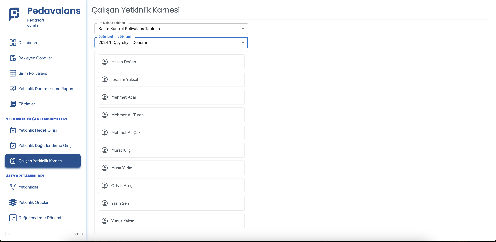
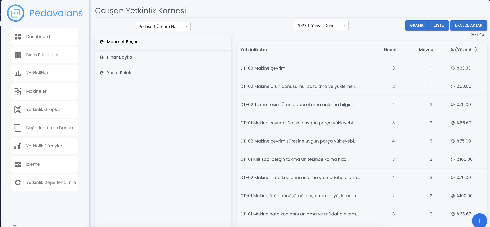
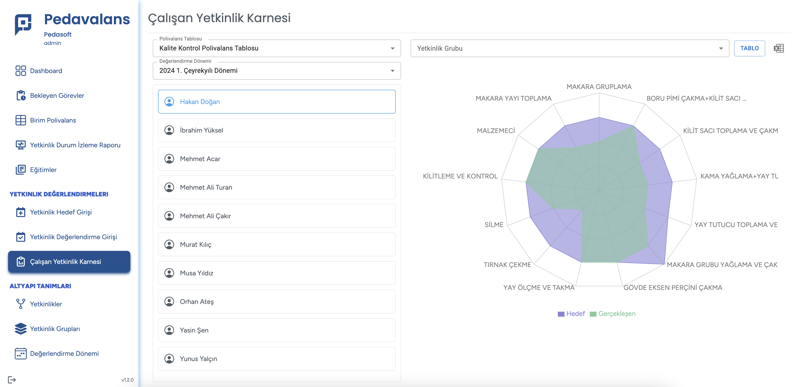

## Çalışan Yetkinlik Karnesi

Yetkinlik hedef ve gerçekleşme girişleri yapılan personelin yetkinlik performans izlemeleri **Çalışan Yetkinlik Karnesi** ekranından yapılabilir. Ana Sayfa'da
Yetkinlik Değerlendirme menüsü altındaki **Çalışan Yetkinlik Karnesi** alt menüsüne tıklanır. Açılan sayfanın üst kısmında polivalans tablosu ve ilgili değerlendirme dönemi seçildiği anda sol tarafta personel listesi görülecektir. 

Yetkinlik performans karnesi görüntülenecek personele tıklandığı anda sağ tarafta ilgili bilgiler görüntülenecektir. Bunlar; yetkinlik tanımı, yetkinliğin dönemsel hedefi, yetkinliğin dönemsel gerçekleşmesi, performans oranı ve performans durumuna uygun ikonlardan oluşmaktadır.

Çalışan yetkinlik karnesi ekranında sağ üstte **Grafik** butonuna tıklandığında o çalışanın seçilen dönemi için yetkinlik durumu radar grafiği üzerinden görüntülenebilecektir.

