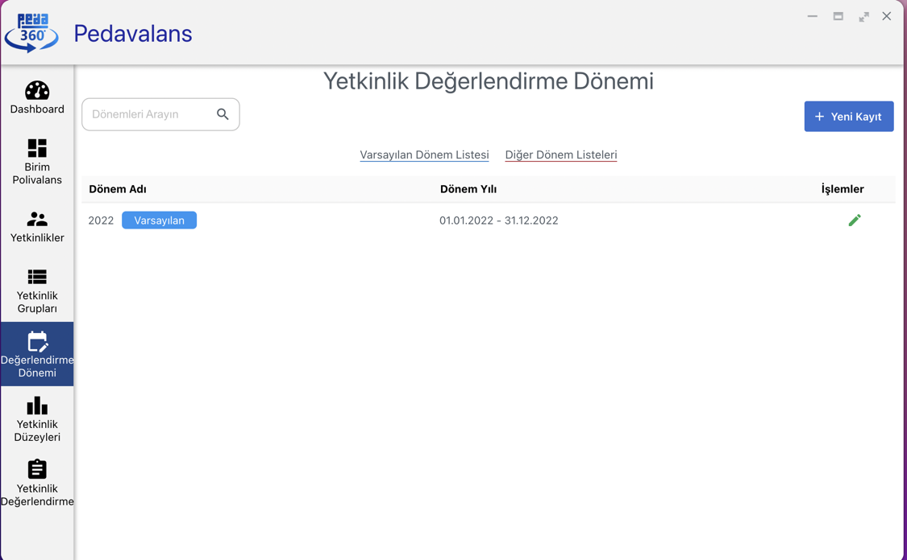

## Değerlendirme Dönemi Tanımlama

Pedavalans'da yetkinlik değerlendirmeleri yapabilmek için mutlaka değerlendirme dönemlerini tanımlamak gerekecektir. Değerlendirme dönemleri, değerlendirme verilerinin yıl
bazlı saklanmasını ve raporlanmasını da sağlayacaktır.

Değerlendirme Dönemi Tanımlamak için, Ana Sayfada **Değerlendirme Dönemi** menüsüne tıklanır.

