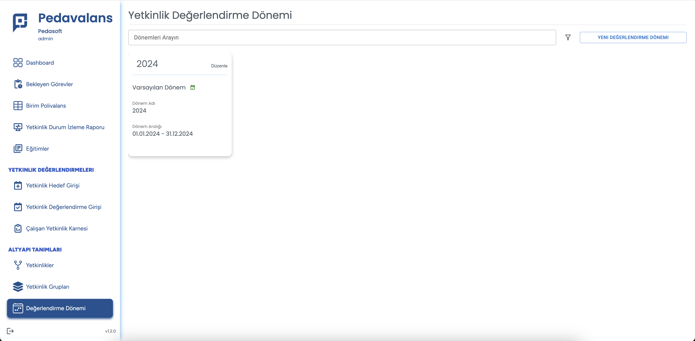
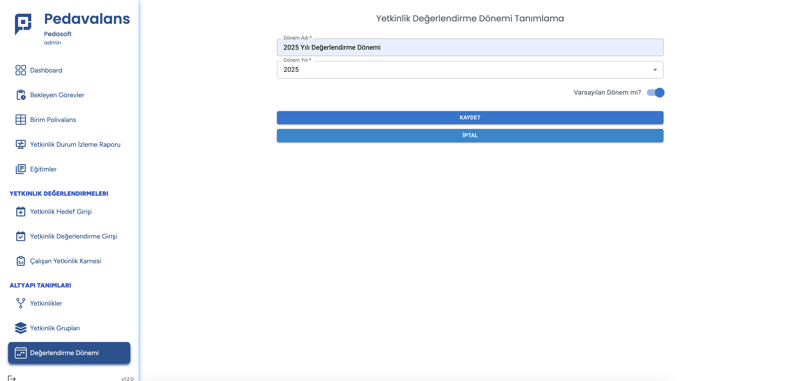

## Değerlendirme Dönemi Tanımlama

Pedavalans'da yetkinlik değerlendirmeleri yapabilmek için mutlaka değerlendirme dönemlerini tanımlamak gerekecektir. Değerlendirme dönemleri, değerlendirme verilerinin yıl
bazlı saklanmasını ve raporlanmasını da sağlayacaktır.

Değerlendirme Dönemi Tanımlamak için, Ana Sayfada **Değerlendirme Dönemi** menüsüne tıklanır.

Yeni Değerlendirme Dönemi eklemek için sağ üstteki **Yeni Kayıt** butonu tıklanır.

Açılan ekranda değerlendirme döneminin tanımını ve hangi yılı kapsayacağı belirtilir.

Ardından **Kaydet** butonu tıklanarak Değerlendirme Dönemi oluşturulmuş olur. Değerlendirme Dönemini kaydederken Varsayılan seçeneği seçilirse geçerli olan dönem olarak belirlenmiş olur ve veri girişlerinin sonucu bu dönem içerisine kaydedilir.
