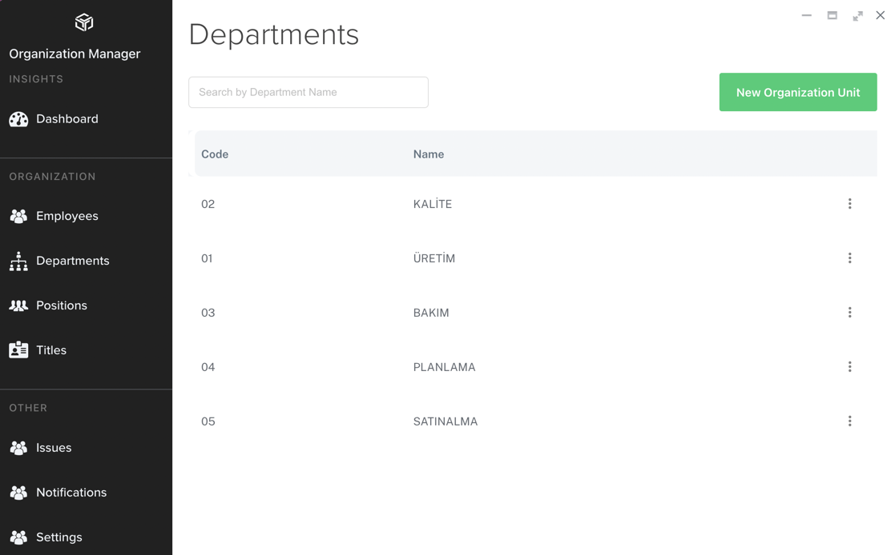
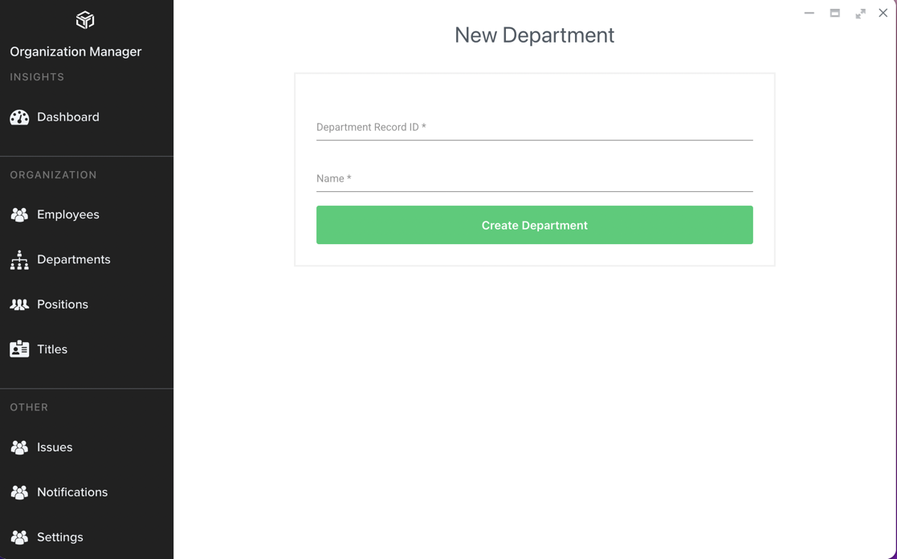

# Department Tanımlama

Organization Manager içerisinde Employee tanımı yapabilmek için gerekli olan bir diğer bilgi de personelin çalıştığı Departmanlar/Birimler'dir. Çalışanların departmanları
**Departments** tablosunda tutulur ve listeden seçim yapılır.

Yeni departman tanımı yapabilmek için **Organization Manager** uygulamasında **Departments** menüsü tıklanır.

Yeni departman eklemek için sağ üstteki **New Organization Unit** butonu tıklanır. Açılan sayfada departmanın kodu/sıra numarası ve departman tanımı girildikten sonra **Create Department** butonu tıklanarak departman kaydı tamamlanmış olur.

