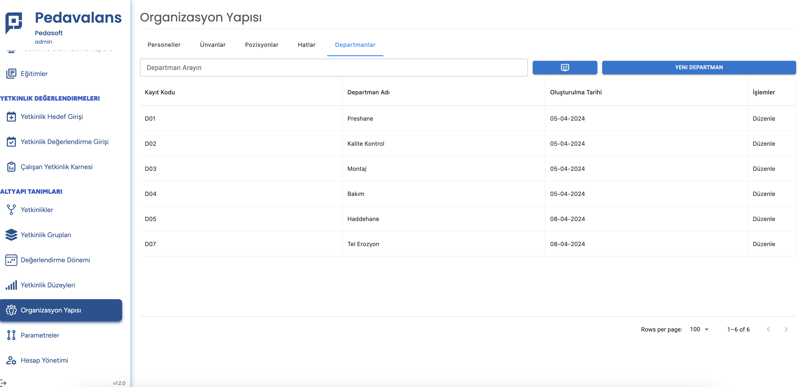
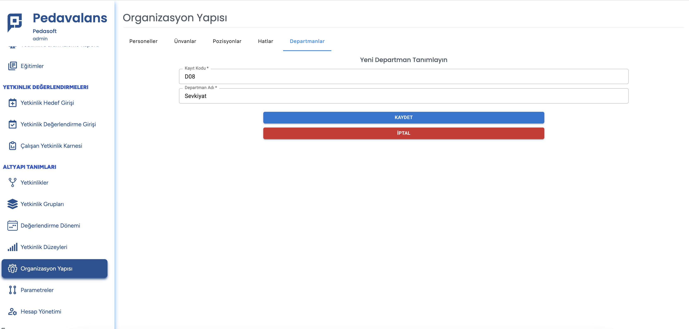

# Departman Tanımlama

Organizasyon Yapısı içerisine Çalışan tanımı yapabilmek için gerekli olan bir diğer bilgi de personelin çalıştığı Departmanlar/Birimler'dir. Çalışanların departmanları
**Departman** tablosunda tutulur ve listeden seçim yapılır.

Yeni departman tanımı yapabilmek için **Organizasyon Yapısı** menüsüne tıklanarak açılan sayfada  **Departmantlar** sekmesi tıklanır.

Yeni departman eklemek için sağ üstteki **Yeni Departman** butonu tıklanır. Açılan sayfada departmanın kodu/sıra numarası ve departman tanımı girildikten sonra **Kaydet** butonu tıklanarak departman kaydı tamamlanmış olur.

