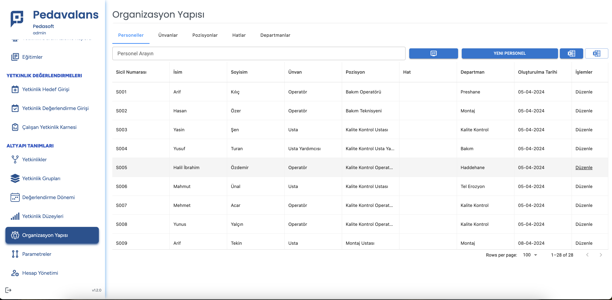
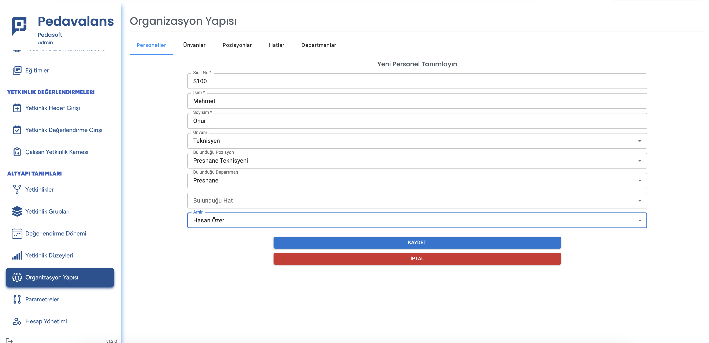

# Personel Tanımlama

**Pedavalans**, içerisinde birim polivalans tablolarında tanımlanacak ve yetkinliklerin otomatik olarak atanacağı; yetkinlik durum izlemelerinin ve raporlarının gerçekleştirileceği çalışanlar Personel tablosuna kayıt edilmelidir. Personel tablosuna manuel olarak kayıt eklemek için sırasıyla aşağıdaki adımlar izlenir:

**Organizasyon Yapısı** menüsü içerisine gelinerek **Personeller** sekmesi görüntülenir.

**Yeni Personel** butonu tıklanır. Açılan sayfada aşağıdaki bilgiler girilerek kaydedilir:

- Sicil No: Personel sicil numarası. Tekil (Unique) olmalıdır. Manuel olarak girilir.
- İsim: Personelin adı. Manuel olarak girilir.
- Soyisim: Personelin soyadı. Manuel olarak girilir.
- Unvanı: Unvan listesinden seçim yapılır.
- Bulunduğu Pozisyon: Pozisyon listesinden seçim yapılır.
- Bulunduğu Departman: Departman listesinden seçim yapılır.
- Bulunduğu Hat: Eğer hat bazlı organizasyon yapısı aktifse ilgili hat seçilir.
- Amir: Çalışanın üst amiri, personel listesinden seçilir.

**Kaydet** butonu tıklanarak Personel tanımı kaydedilmiş olur.
