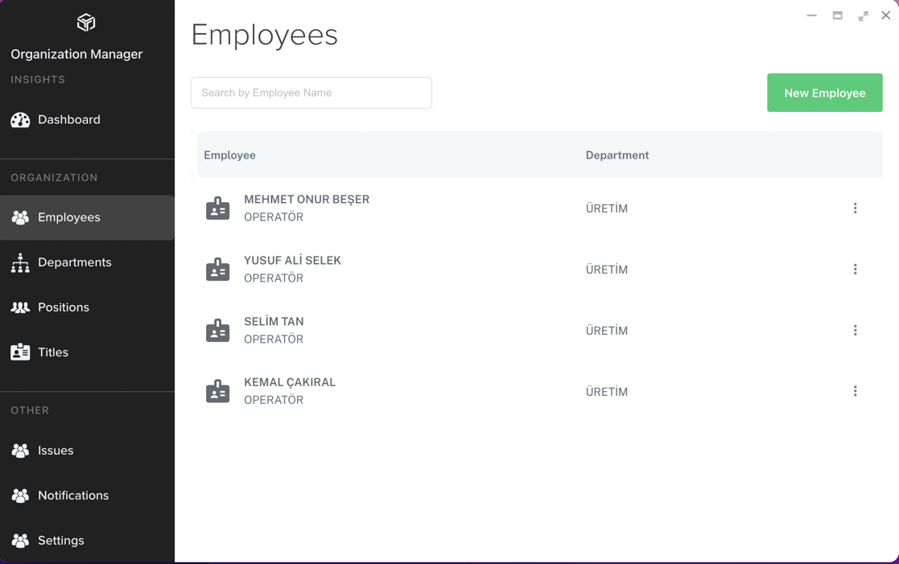
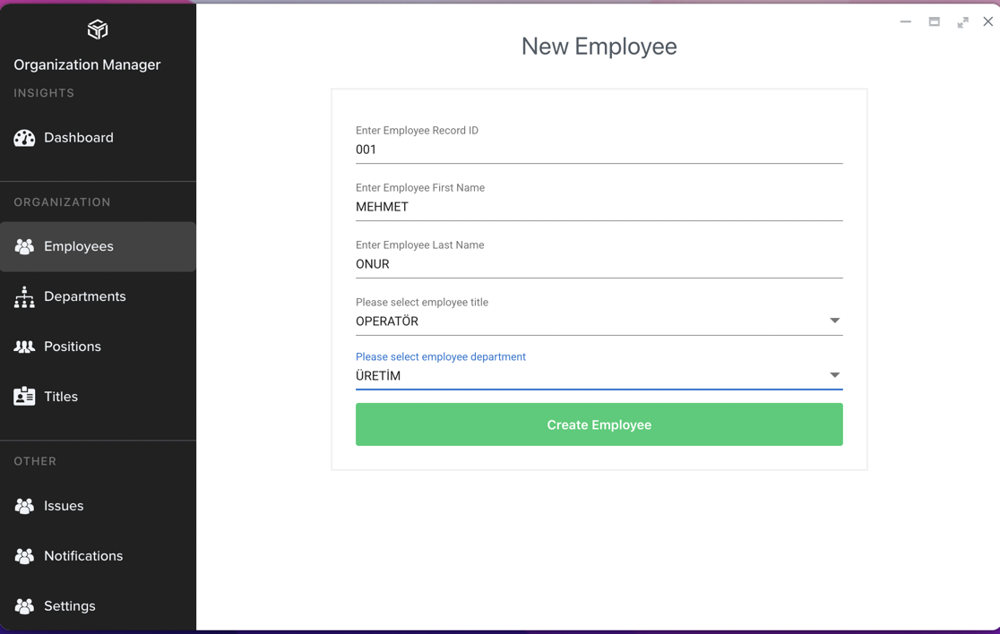

**"Employee"**, **Peda360** içerisindeki uygulamalarda personel seçimlerinde kullanılacak firma çalışanlarıdır. Employee'ler Accountlardan farklı olup, uygulamalardaki personel bazlı fonksiyonların gerçekleştirilmesinde kullanılırlar. 

Employee Tanımlamak için Organization Manager uygulaması içinde **Employee** menüsü tıklanır. 

**New Employee** butonu tıklanır. Açılan sayfada aşağıdaki bilgiler girilerek kaydedilir:

- Employee Record ID: Personel sicil numarası.
- Enter Employee First Name: Personelin adı.
- Enter Employee Last Name: Personelin soyadı.
- Please Select Employee Title: Personel ünvan tanımı seçimi.
- Please Select Employee Department: Personel departman tanımı seçimi.

**Create Employee** butonu tıklanarak Employee Tanımı kaydedilmiş olur.
