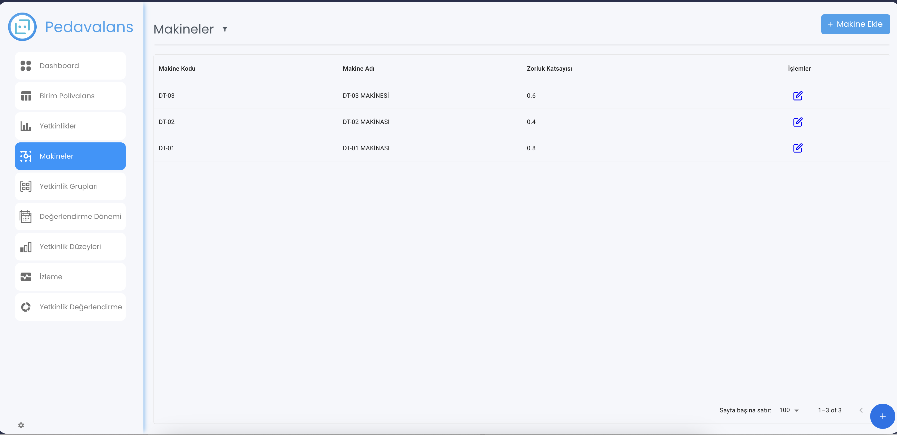
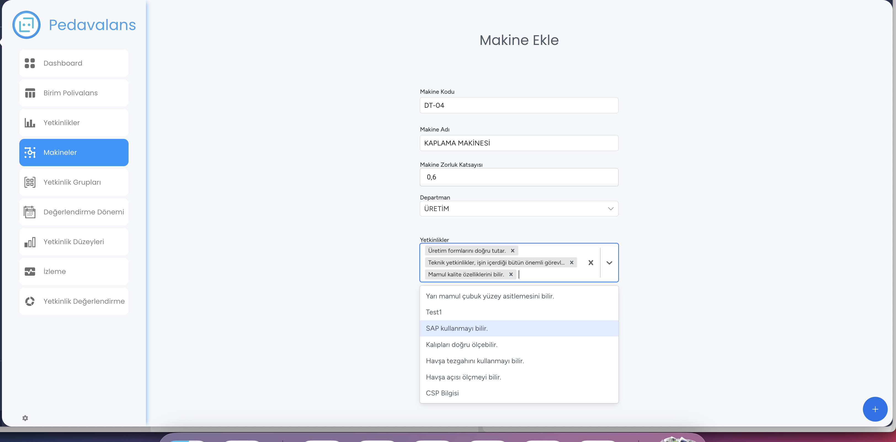

## Makine Tanımlama

Eğer **Pedavalans**'ta **Makine Bazlı Polivalans Yönetimi** özelliği kullanılacaksa, uygulamayı kullanan firmadaki makinelerin ve makinelere bağlı olan yetkinliklerin belirtilmesi gereklidir.
Bunun için öncelikle sol taraftaki menü listesinden **Makineler** menüsü tıklanır.

Açılan sayfada sağ üstteki **Yeni Makine** butonu tıklanarak yeni makine kaydetme ekranı görüntülenecektir. Bu sayfada Makine Adı girilir, İlgili Departmanı ve seçilen departmanlara göre
alttaki seçim alanından ilişkili yetkinlikler seçilir.

Tüm bu bilgilr girildikten sonra **Kaydet** butonu tıklanarak makine kayıt işlemi tamamlanmış olur.

