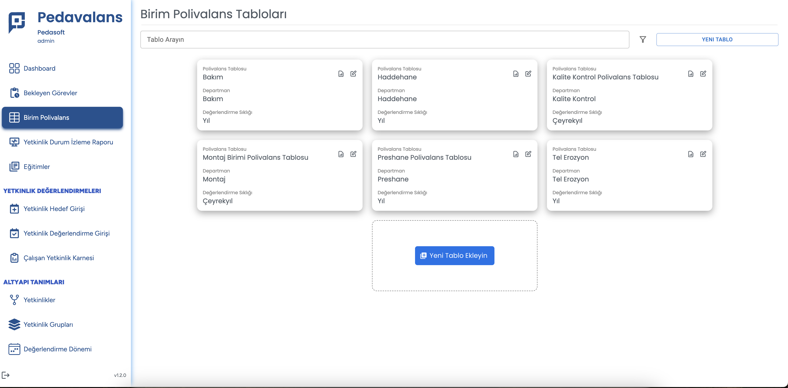
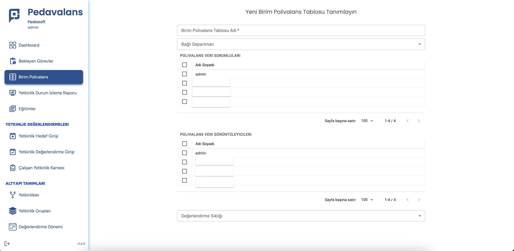

## Birim Polivalans Tablosu Tanımlama

Pedavalans uygulamasında Polivalans tablolarını oluşturmak için öncelikle Ana Sayfa'daki **Birim Polivalans** menüsü tıklanır. Açılan sayfada kayıtlı polivalans
tabloları görüleceği gibi **Yeni Tablo Ekleyin** butonu tıklanarak yeni polivalans tablosu tanımlama sayfası açılacaktır.

Açılan sayfada oluşturulacak Birim Polivalans Tablosu'nun adı girilir. Polivalans tablosunun ait olduğu departman, departman listesinden seçilir. Polivalans hedef ve gerçekleşme girişlerini yapabilecek olan kullanıcı hesap/hesapları **Polivalans Veri Sorumluları** kısmından seçilir. Polivalans verilerini göreebilecek kullanıcı hesapları da **Polivalans Tablosunu Görüntüleyebilecek Kişiler** alanından seçilir. Son olarak polivalans tablosundaki verilerin giriş sıklığı **Değerlendirme Sıklığı** alanından seçilir. Bu listede

- **Yıl** seçilirse, varsayılan değerlendirme döneminde yılda 1 kere;
- **Yarı Yıl** seçilirse, varsayılan değerlendirme döneminde yılda 2 kere;
- **Çeyrek Yıl** seçilirse, varsayılan değerlendirme döneminde yılda 4 kere;
- **Ay** seçilirse, varsayılan değerlendirme döneminde yılda 12 kere veri girişi yapılacak anlamına gelir.

**Kaydet** butonu tıklandığında Polivalans tablosu kaydedilmiş olur. Bu sayede ilgili departmandaki tüm çalışanlar ve bu departmanla ilgili tüm yetkinlikler eşleştirilerek yetenek matrisi otomatik olarak oluşmuş olacaktır.
