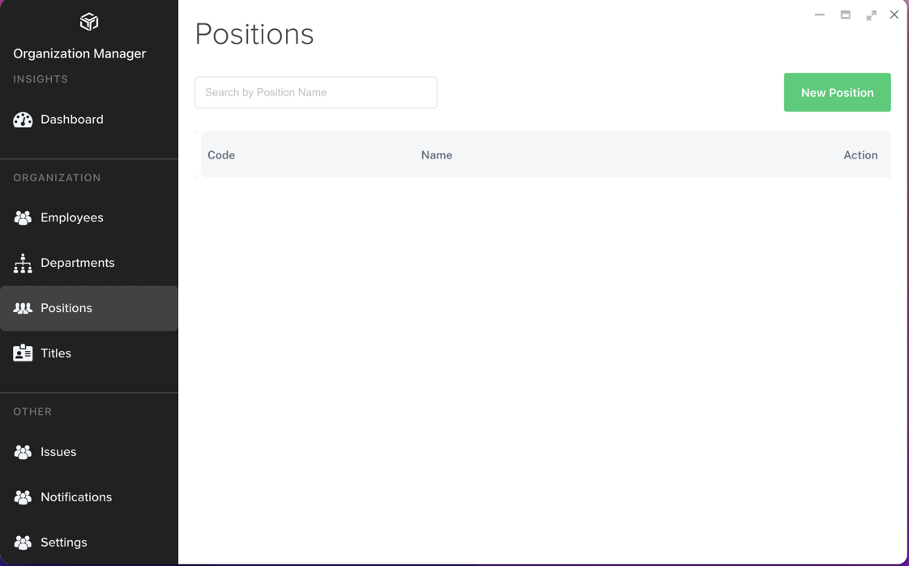
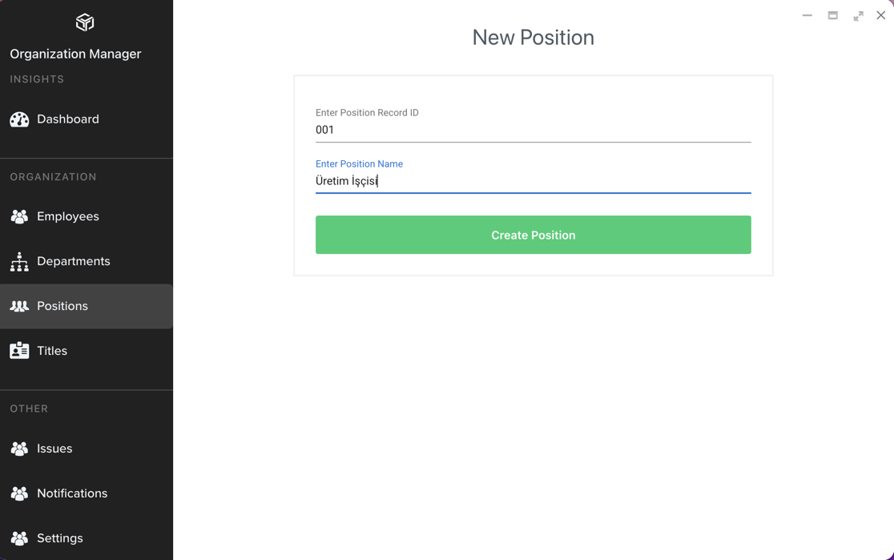

# Pozisyon Tanımlama

Pozisyon tanımlama, Employee tanımları için zorunlu olmamakla beraber personelin ait olduğu görev tanımlarının belirlenmesinde gereklidir. Çalışanların hangi 
pozisyonda oldukları ve hangi görevi yerine getirdikleri **Peda360**'daki çeşitli uygulamalarda kullanılabilmektedir. Dolayısıyla personelin pozisyon tanımları da 
sistem içinde bulunmalıdır.

Pozisyon tanımı gerçekleştirmek için **Organization Manager** uygulamasında **Positions** menüsü tıklanır.

Sağ üstteki **New Position** butonu tıklanarak Yeni Pozisyon tanımlama sayfası görüntülenir. Bu sayfada pozisyonun sıra numarası/kodu ve pozisyon tanımı girilir.

**Create Pozition** butonu tıklanarak pozisyon kaydedilmiş olur.
