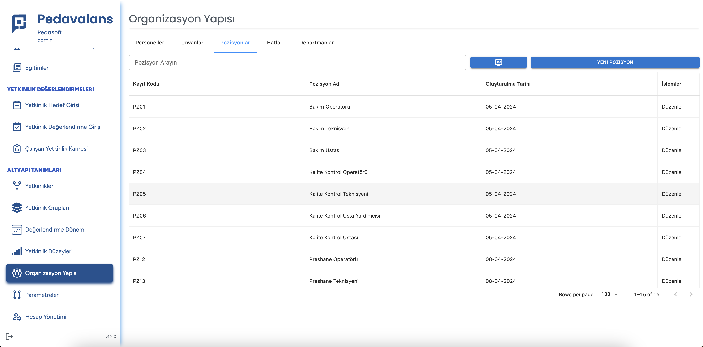
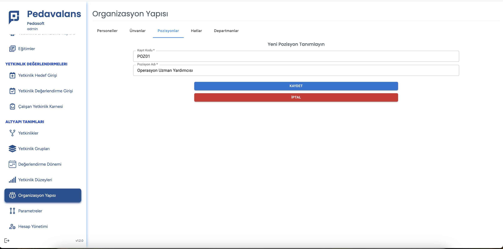

# Pozisyon Tanımlama

Pozisyon tanımlama, Personel tanımları için zorunlu olmamakla beraber personelin ait olduğu görev tanımlarının belirlenmesinde gereklidir. Çalışanların hangi 
pozisyonda oldukları ve hangi görevi yerine getirdikleri **Pedavalans** içerisindeki rapor ve dashboardlarda görülebileceğinden personelin pozisyon tanımlarının gerçekleştirilmesi önerilmektedir. 

Pozisyon tanımı gerçekleştirmek için ana ekrandaki sol menüde bulunan **Organization Yapısı** butonu tıklandıktan sonra **Pozisyonlar** sekmesi görüntülenir.

Sağ üstteki **Yeni Pozisyon** butonu tıklanarak Yeni Pozisyon tanımlama sayfası görüntülenir. Bu sayfada pozisyonun sıra numarası/kodu ve pozisyon tanımı girilir.

**Kaydet** butonu tıklanarak pozisyon kaydedilmiş olur.

Bu tabloda oluşturulan pozisyon tanımları, personel tanımlama ekranında seçilebilecektir.
