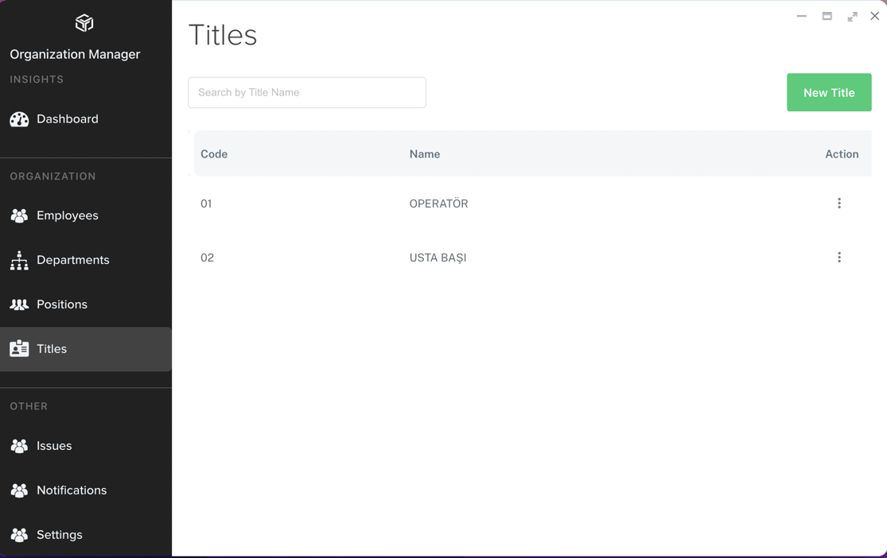
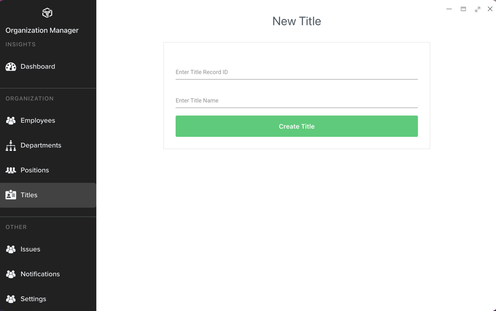

# Title Tanımlama

Title tanımlama işlemi, **Organization Manager** da employee tanımlama işlemi öncesinde yapılması gereken ve personelin unvanlarının tanımlanmasına imkân tanıyan
bir fonksiyondur. 

Title tanımlamak için **Organiztion Manager** uygulamasunda **Titles** menüsüne tıklanır. Açılan sayfada sistemde tanımlı unvan kayıtları görülecektir.

Yeni unvan tanımlı eklemek için **New Title** butonı tıklanır. Açılan sayfada unvana verilecek sıra numarası ile Unvan tanımı girilir. **Create Title** butonu tıklanarak unvan tanımı kaydedilmiş olur.

