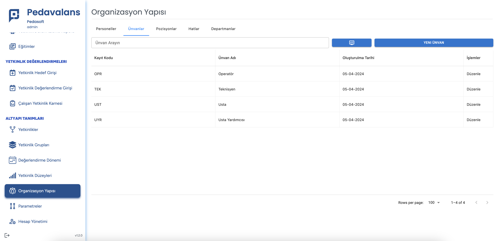
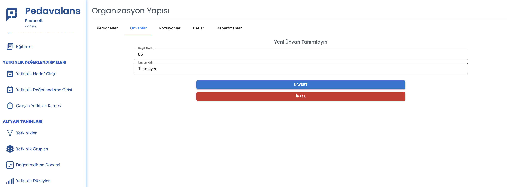

# Unvan Tanımlama

Unvan tanımlama işlemi, Pedavalans içerisinde yetkinlik ölçümü ve takibi yapılacak çalışanların sisteme tanımlanmasından önce yapılmasu gereken bir işlemdir. Sol taraftaki menüde **Orgnizasyon Yapısı** butonu tıklandığında açılan sayfada **Unvanlar** sekmesine tıklanarak sistemde tanımlı tüm unvanlar görülebileceği gibi Yeni Unvan tanımlaması da yapılabilecektir.

Yeni unvan tanımlı eklemek için **Yeni Unvan** butonı tıklanır. Açılan sayfada unvana verilecek sıra numarası ile Unvan tanımı girilir. **Kaydet** butonu tıklanarak unvan tanımı kaydedilmiş olur.

