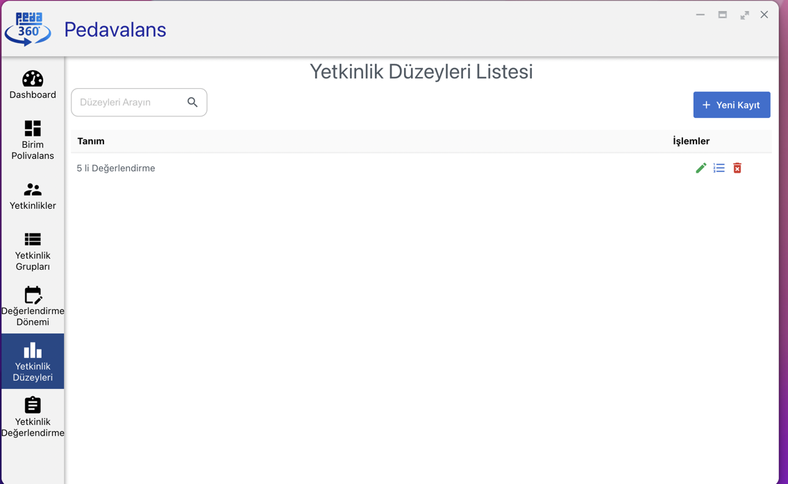

## Yetkinlik Düzeyi Tanımlama

Pedavalans uygulamasını kullanmaya başlamak için öncelikle polivalans tablolarındaki değerlendirmelerde kullanılacak yetkinlik seviyelerinin tanımlanması gerekmektedir. Bunun için öncelikle Pedavalans uygulamasındaki **Yetkinlik Düzeyleri** menüsüne tıklanır.

