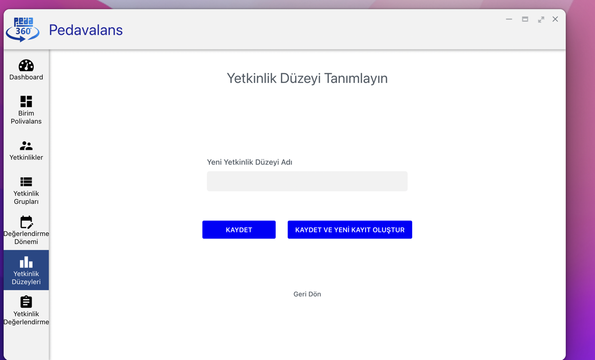

## Yetkinlik Düzeyi Tanımlama

Pedavalans uygulamasını kullanmaya başlamak için öncelikle polivalans tablolarındaki değerlendirmelerde kullanılacak yetkinlik seviyelerinin tanımlanması gerekmektedir. Bunun için öncelikle Pedavalans uygulamasındaki **Yetkinlik Düzeyleri** menüsüne tıklanır.

Ardından sağ üstteki Yeni Kayıt butonu tıklanarak Yeni Yetkinlik Düzeyi tanımlama ekranı açılır.

Yetkinlik düzeyinin adı girilir ( Ör: 5'li Değerlendirme Düzeyi) ardından Kaydet butonu tıklanır. Kaydedilen yetkinlik düzeyleri listesinde görülecektir. İlgili yetkinlik düzeyinin sağında yer alan kalem ikonu tıklanarak yetkinlik düzey elementlerinin girileceği ekran görüntülenir.

Bu sayfada yetkinlik düzeyine ait seviye tanımları ve seviyenin sayısal değeri girilerek Ekle butonu tıklanır. Tüm seviyeler eklendikten sonra işlem tamamlanmış olur.

Pedavalans uygulamasında istenildiği kadar Yetkinlik Düzeyi tanımlanabilmektedir.
