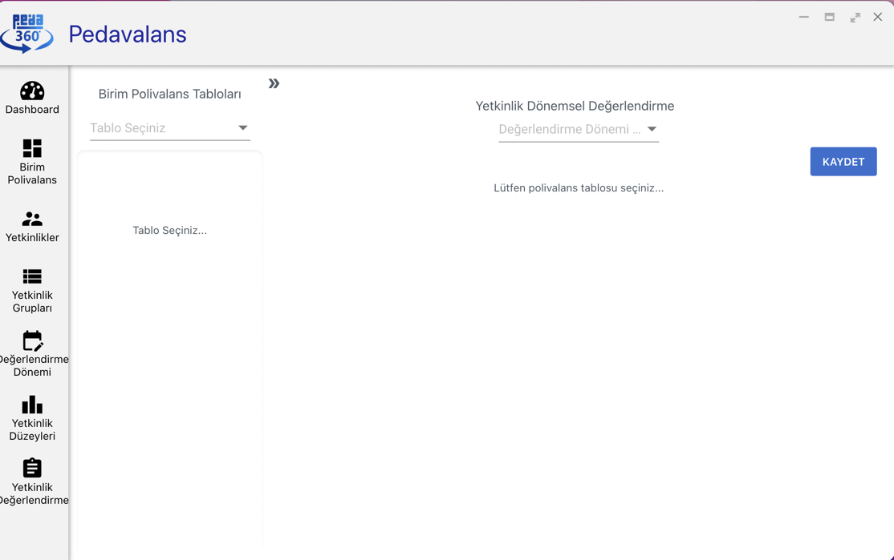
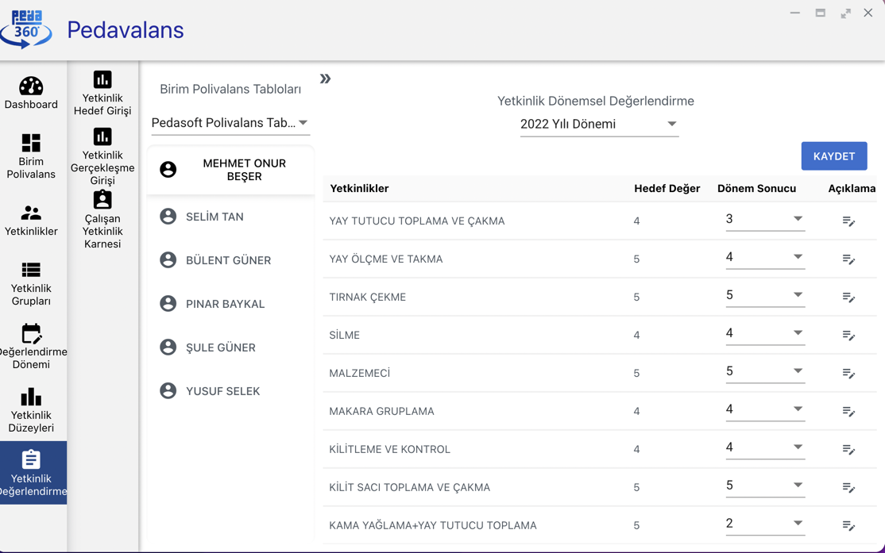

## Yetkinlik Gerçekleşme Girişi

Pedavalans uygulamasında yetkinliklerin hedef değerlendirmeleri yapıldıktan sonra birim polivalans tablolarında seçilen değerlendirme sıklıklarına göre gerçekleşme
girişlerinin yapılması gerekmektedir.

- Örneğin polivalans tablosunda değerlendirme sıklığı **Yarı Yıl** olarak seçilmişse yılda 2 kere personelin yetkinliğinin mevcut gerçekleşme durumu sisteme girilmelidir.

Ana Sayfa'da **Yetkinlik Değerlendirme** menüsüne tıklanır. Açılan alt menüde **Yetkinlik Gerçekleşme Girişi** seçilir.

Yetkinlik Dönemsel Gerçekleşme Girişi ekranı görüntülenecektir. Bu ekranda üst kısımdan ilgili polivalans tablosu ve gerçekleşme girişleri hangi döneme aitse ilgili dönem seçildiği anda polivalans tablosu ile ilişkili tüm personelin listesi ekrana gelecektir. Veri girişi yapılacak personel adına tıklandığı anda personel ile ilgili yetkinlikler, bunlara ait hedef değerler sabit bir şekilde gelecektir. Personelin dönemsel yetkinlik gerçekleşmesi ise **Dönem Sonucu** isimli puanlı listeden seçilir. Eğer dönem sonucu ile ilgili bir açıklama girişi olacaksa Dönem Sonucu alanının yanındaki **Açıklama** ikonundan dönem sonucuna ait açıklama girilebilecektir.

Tüm dönemsel gerçekleşmeler girildikten sonra Kaydet tuşu tıklanarak seçilen kişi için ilgili verilerin girişi kaydedilmiş olur.
