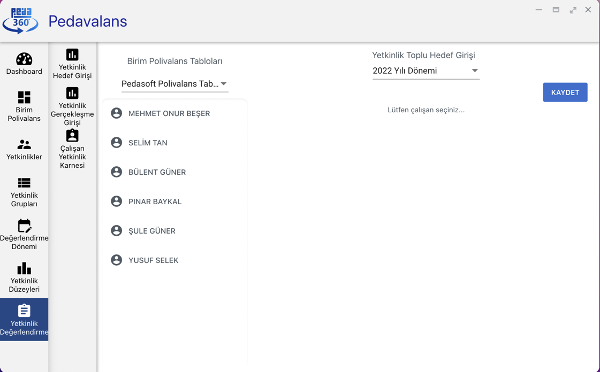

## Yetkinlik Gerçekleşme Girişi

Pedavalans uygulamasında yetkinliklerin hedef değerlendirmeleri yapıldıktan sonra birim polivalans tablolarında seçilen değerlendirme sıklıklarına göre gerçekleşme
girişlerinin yapılması gerekmektedir.

- Örneğin polivalans tablosunda değerlendirme sıklığı **Yarı Yıl** olarak seçilmişse yılda 2 kere personelin yetkinliğinin mevcut gerçekleşme durumu sisteme girilmelidir.

Ana Sayfa'da **Yetkinlik Değerlendirme** menüsüne tıklanır. Açılan alt menüde **Yetkinlik Gerçekleşme Girişi** seçilir.

