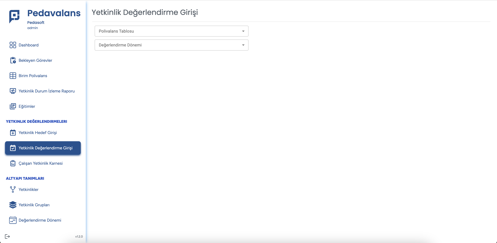
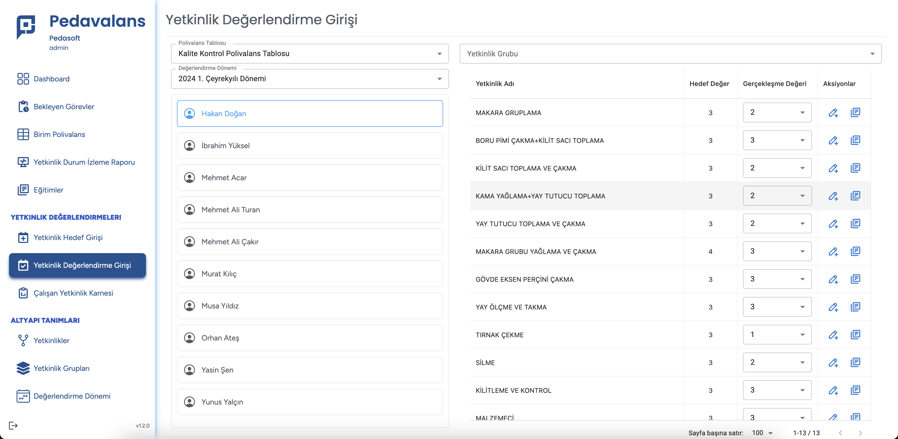
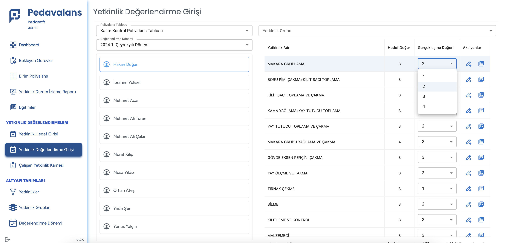

## Yetkinlik Değerlendirme Girişi

Pedavalans uygulamasında yetkinliklerin hedef değerlendirmeleri yapıldıktan sonra birim polivalans tablolarında seçilen değerlendirme sıklıklarına göre gerçekleşme
girişlerinin yapılması gerekmektedir.

- Örneğin polivalans tablosunda değerlendirme sıklığı **Yarı Yıl** olarak seçilmişse yılda 2 kere personelin yetkinliğinin mevcut gerçekleşme durumu değerlendirme sonucu olarak sisteme girilmelidir.

Ana Sayfa'da **Yetkinlik Değerlendirme** menüsüne tıklanır. Açılan sayfada  **Polivalans Tablosu**  ve **Değerlendirme Dönemi** seçim alanları görülebilecektir.

Bu ekranda üst kısımdan ilgili polivalans tablosu ve gerçekleşme girişleri hangi döneme aitse ilgili dönem seçildiği anda polivalans tablosu ile ilişkili tüm personelin listesi ekrana gelecektir. Veri girişi yapılacak personel adına tıklandığı anda personel ile ilgili yetkinlikler, bunlara ait hedef değerler sabit bir şekilde gelecektir. Personelin dönemsel yetkinlik gerçekleşmesi ise **Gerçekleşme Değeri** isimli puanlı listeden seçilir. 

Eğer dönem sonucu ile ilgili bir açıklama girişi olacaksa **Aksiyonlar** başlığının altındaki kalem ikonuna tıklayarak bir açıklama eklenebilir.

Eğer yetkinlik gerçekleşme değeri girişi sonrasında bir açıklama girilmek istenirse mavi renkli **Açıklama** ikonuna tıklanır, açılan popup ekranda o döneme ait gerçekleşme değeri ile ilgili açıklama girişi yapılır ve **Kaydet** butonu tıklanarak açıklama kaydedilmiş olur.

