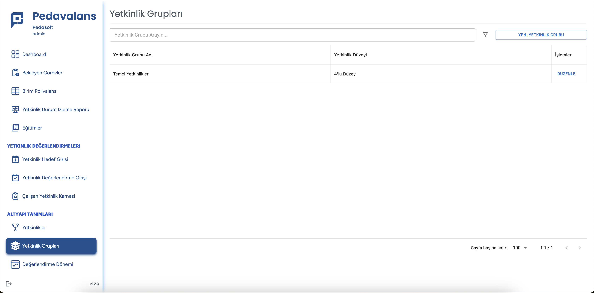
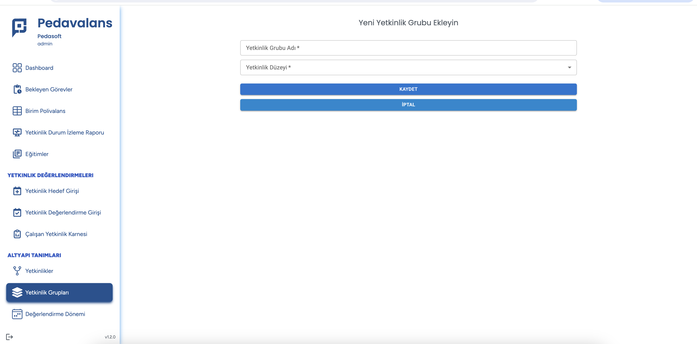

## Yetkinlik Grubu Tanımlama

Pedavalans uygulamasında yetkinlikleri tanımlama işleminden hemen önce yapılması gereken adım, **Yetkinlik Gruplarının Tanımlanması** işlemidir. Yetkinlik grupları, yetkinliklerin
ait olduğu kategori/üst başlıklar olarak düşünülebilir. Yetkinlik grupları, yetkinlik değerlendirme seviyeleri ile ilişkilendirileceğinden uygulamada en az 1 tane
yetkinlik grubu bulunmalıdır.

Ana Sayfada **Yetkinlik Grubu Tanımlama** menüsü tıklanır. Açılan ekranda Yeni Kayıt butonu tıklanır.

Yeni Yetkinlik Grubu ekleme sırasında Yetkinlik Grubu'nın tanımı yazılır ve bu yetkinlik grubuna bağlı olacak yetkinliklerin ilişkili yetkinlik değerlendirme düzeyi listeden seçilirerek Kaydet tuşu tıklanır.

