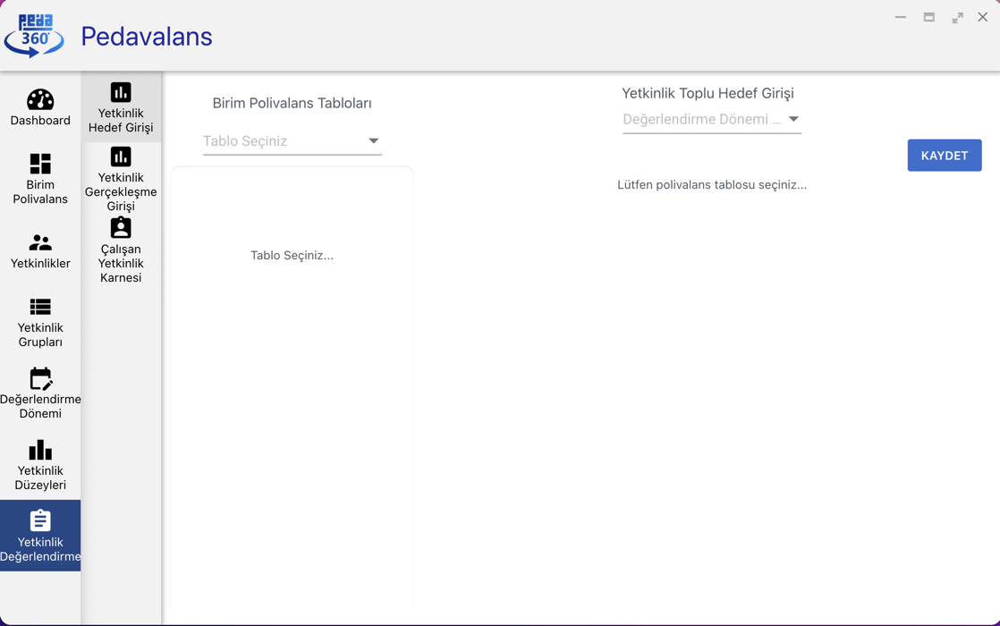

## Yetkinlik Hedef Değerlendirmesi

Pedavalans uygulamasında yetkinlikleri ve birim polivalans tablolarını oluşturduktan sonra personelin yetkinliklerinin hedef değerlerinin girilmesi gereklidir. 
Hedef değerler personelin ulaşması gereken yetkinlik skorunu ifade eder ve ilgili polivalans tablosu veri sorumlusu tarafından yetkinliğin değerlendirme düzeylerine göre
açılır liste biçimindeki alandan seçilerek kaydedilir.

Ana Sayfa'da **Yetkinlik Değerlendirme** menüsüne tıklanır. Açılan alt menüde **Yetkinlik Hedef Girişi** seçilir.

