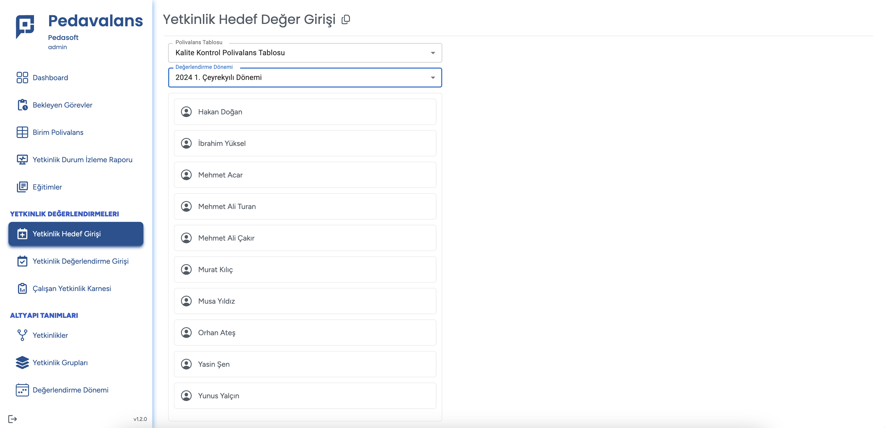
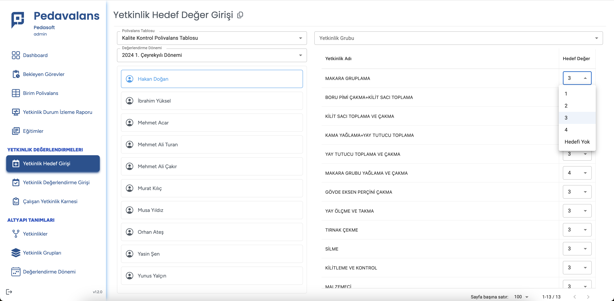

## Yetkinlik Hedef Değerlendirmesi

Pedavalans uygulamasında yetkinlikleri ve birim polivalans tablolarını oluşturduktan sonra personelin yetkinliklerinin hedef değerlerinin girilmesi gereklidir. 
Hedef değerler personelin ulaşması gereken yetkinlik skorunu ifade eder ve ilgili polivalans tablosu veri sorumlusu tarafından yetkinliğin değerlendirme düzeylerine göre
açılır liste biçimindeki alandan seçilerek kaydedilir.

Ana Sayfa'da **Yetkinlik Değerlendirme** menüsüne tıklanır. Açılan alt menüde **Yetkinlik Hedef Girişi** seçilir.

Açılan sayfanın üst kısmında sırası ile hedef girişleri yapılacak polivalans tablosu ve verilerin kaydedileceği değerlendirme dönemleri listeden seçildiği anda; seçilen polivalans tablosu ile ilişkili tüm personelin listesi gelecektir.

Hedef değeri girilecek personel soldaki listeden seçildiği anda ekranın sağ tarafında otomatik olarak o personel ile ilişkili tüm yetkinliklerin listesi gelecektir. Yetkinliklerin hemen yan tarafındaki puanlı listeden yetkinliğin istenen hedef seviyesi seçilir. Tüm girişler tamamlandıktan sonra **Kaydet** butonu tıklandığında bu personel için hedef girişleri tamamlanmış olur.

