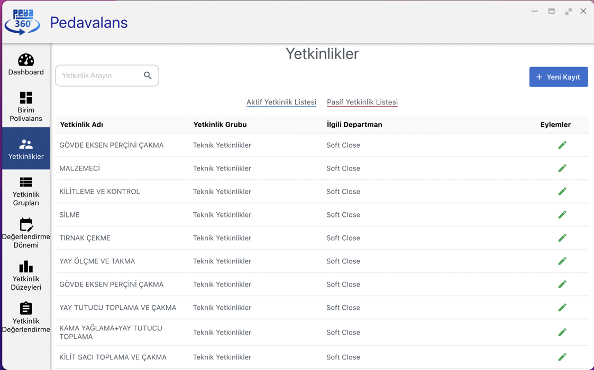
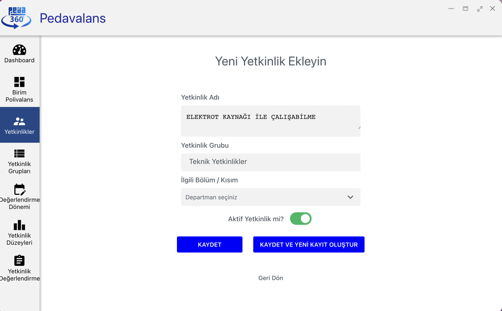

## Yetkinlik Tanımlama

Pedavalans uygulamasında bir yetkinlik havuzu oluşturularak sonrasında tanımlanacak Birim Polivalans Tabloları'nda bu yetkinliklerin değerlendirilmeleri gerçekleştirilecektir. Dolayısıyla öncelikle Yetkinlik Listesi'ne organizasyondaki tüm yetkinliklerin eklenmesi gerekmektedir. Ana Sayfa'da yer alan **Yetkinlikler** menüsüne tıklanarak Yetkinlik Listesi'ne ulaşılır.

Yeni yetkinlik eklemek için sağ üstteki Yeni Kayıt butonu tıklanır. Açılan sayfada **Yetkinlik Tanımı** girilir. Ardından yetkinliğin ait olacağı **Yetkinlik Grubu** listeden seçilir. Son olarak bu yetkinlik hangi departmandaki çalışanları ilgilendiriyorsa **İlgili Bölüm/Kısım** kısmına tıklandığında açılan seçim ekranından ilgili departman/lar seçilir. Kaydet tuşuna tıklayarak yetkinlik listeye eklenmiş olur.

