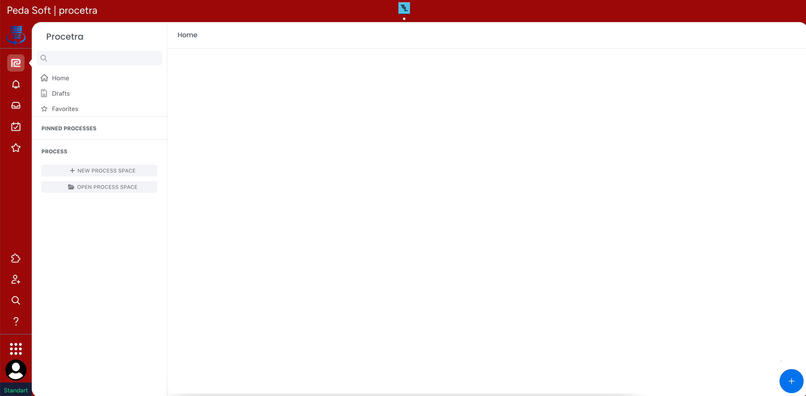
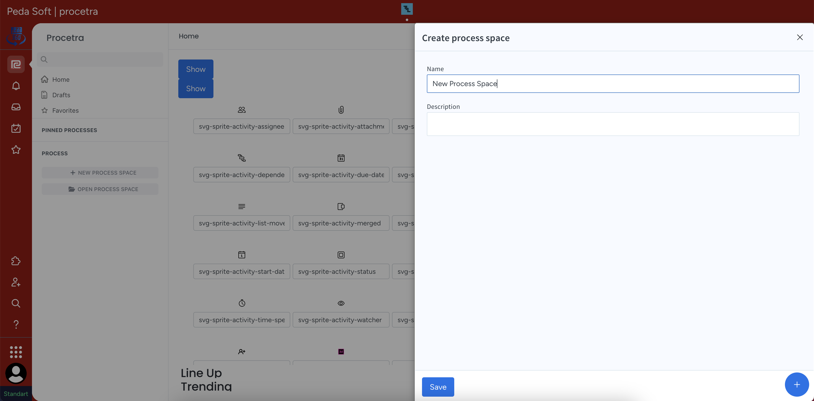
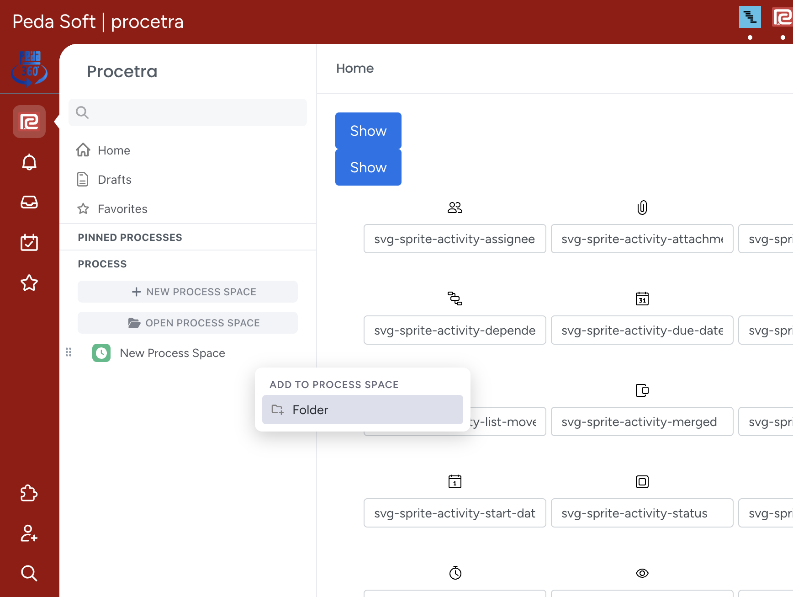
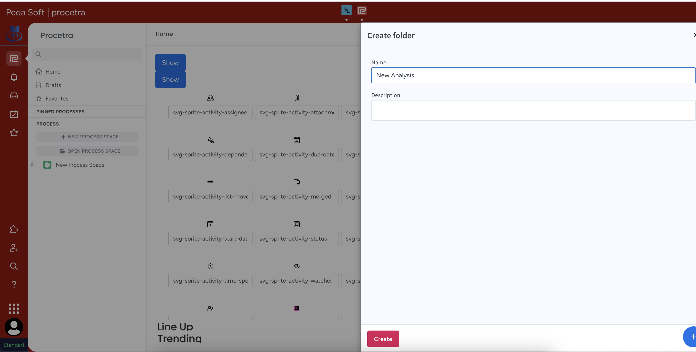
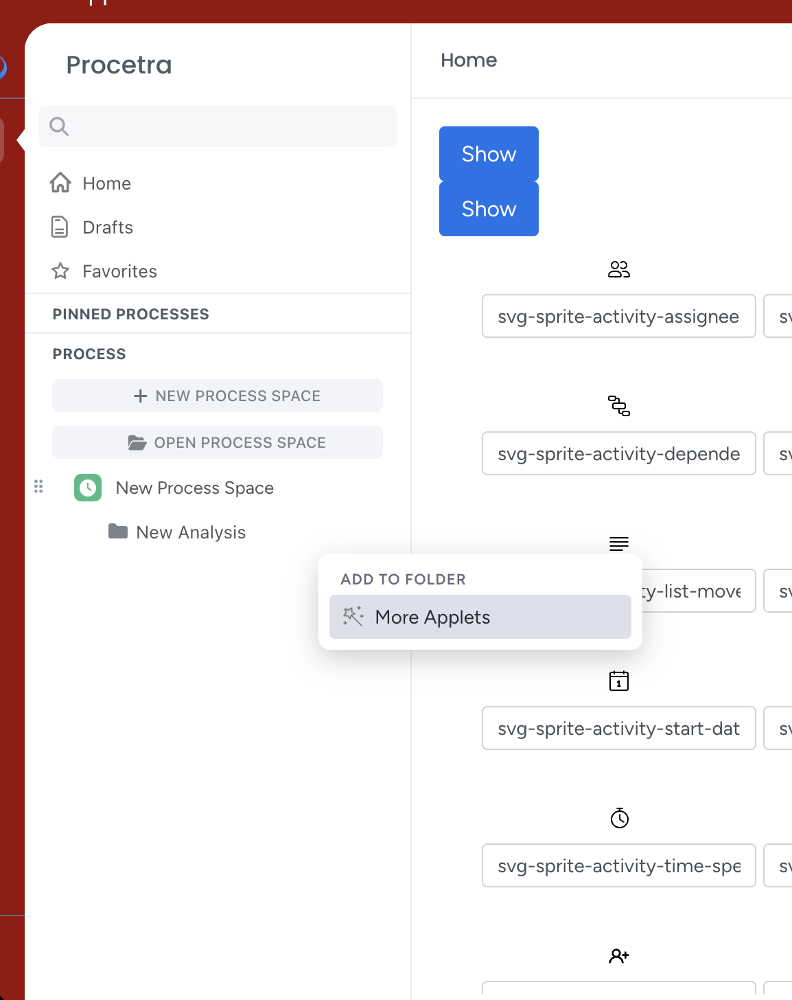
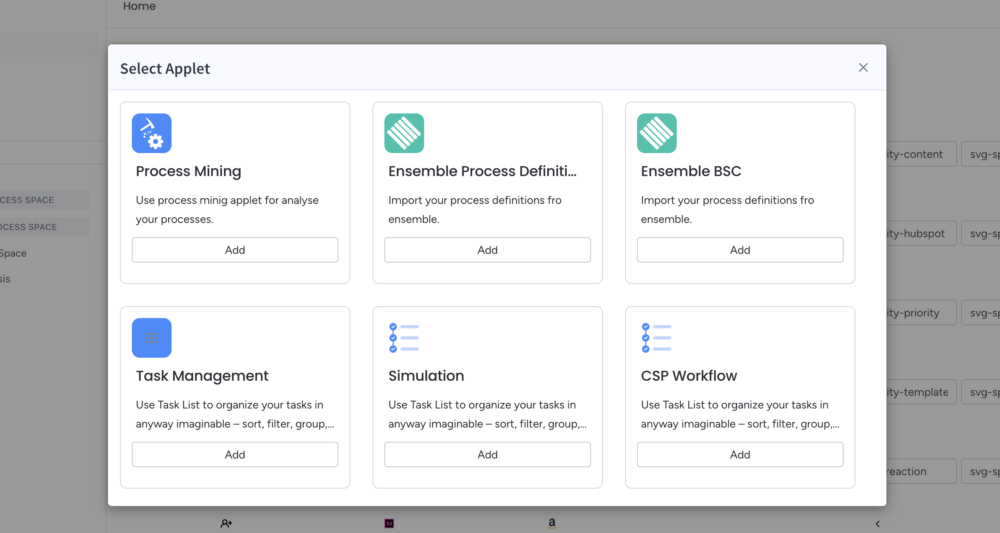
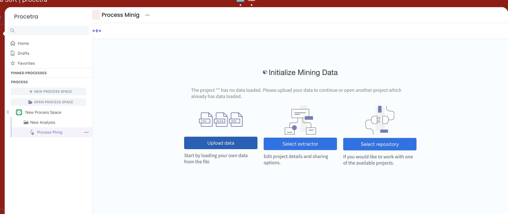
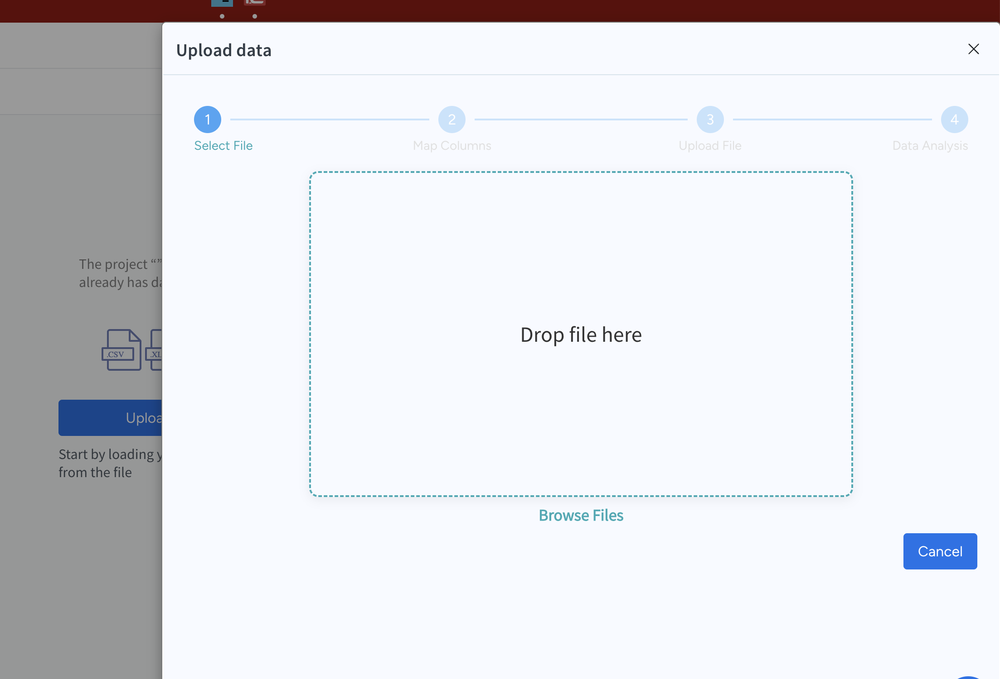
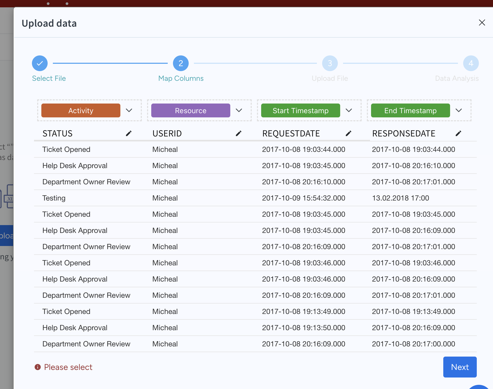

# Procetra'ya Nasıl Veri (Dataset) Yükleyebilirim?

**Peda360** platformuna giriş yapıldıktan sonra sol alt köşede yer alan grid ikonu tıklanır. Açılan uygulama menüsünde **Procetra** ikonu seçilir. **Procetra** anasayfası boş bir şekilde açılacaktır.
Ardından sol taraftaki menüde yer alan **New Process Space** butonu tıklayaran yeni süreç alanı yaratma pop-up'ı görüntülenir.

 Burada süreç alanınımıza bir isim verdikten sonra **Save** butonunu tıklayarak kaydederiz. Kaydettiğimiz süreç alanının üzerindeki + butonunu tıklayarak süreç alanındaki analizleri saklamak üzere yeni bir klasör ekleyeceğiz. 

Açılan pop-up'da klasörümüze bir isim vererek kaydediyoruz.

Şimdi sıra kaydettiğimiz klasörün içerisinde yeni bir **Applet** ekleyerek süreç verilerini yüklemekte. Bunun için klasörün üzerine fare imleci ile gelerek **More Applets** linkini tıklayalım.

Açılan **Applet** sayfasından **Process Mining**'in altındaki **Add** ikonuna tıklayalım.

Karşımıza veri yükleme ekranı gelecektir. Bu ekran üzerinden bilgisayarımızda hazır mevcut olan .csv , .xlsx ya da .xes formatındaki verileri **Upload Data** butonunu tıklayarak içeri aktarabiliriz.

**Upload Data** butonunu tıkladığımızda verileri bilgisayarımızdan seçmemizi sağlayan bir pop-up açılacaktır. Süreç verilerinin bulunduğu dosyayı seçtikten sonra **Next** tuşu ile sonraki adıma geçilir.

Sonraki ekranda elimizde bulunan mevcut süreç datalarındaki bazı bilgilerin **Procetra**'ya tanıtılması gerekmektedir. Bunlar;

1.**Case Id**
2.**Activity**
3.**Resource**
4.**Start Timestamp**
5.**End Timestamp**

Excel dosyasındaki hangi sutun başlıklarının, **Procetra**'daki hangi alana dek geldiği bir kereye mahsus seçildikten sonra **Upload** butonu tıklanarak süreç verileri içeri aktarılmış olur.
