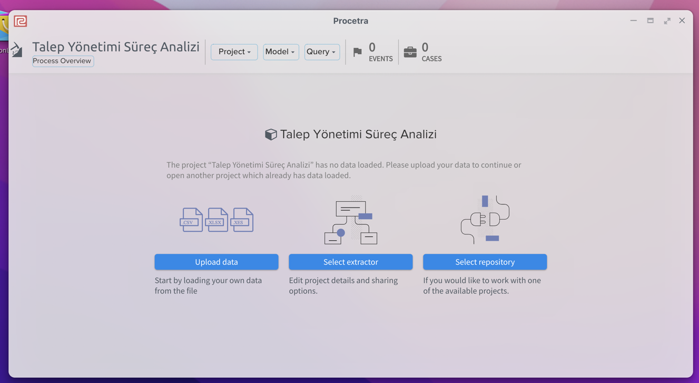
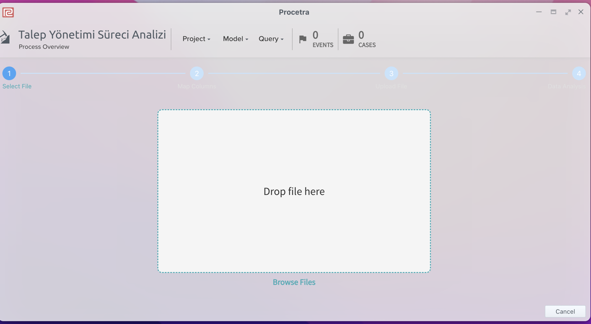
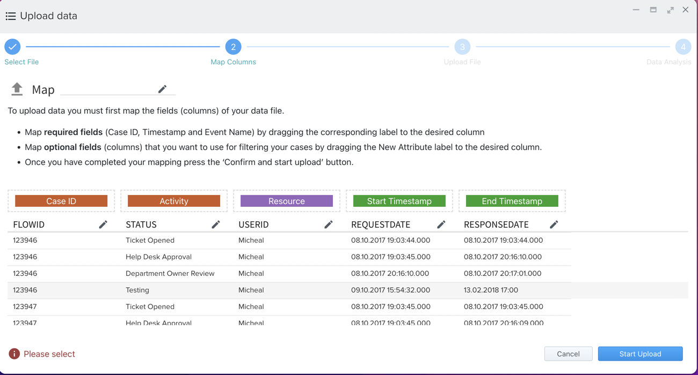
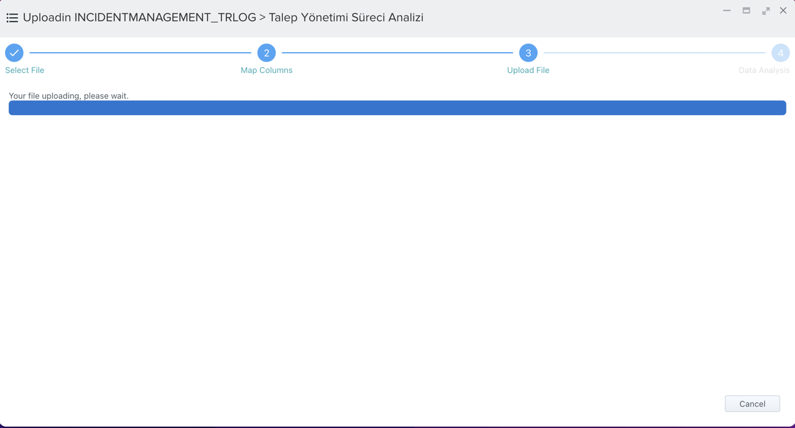
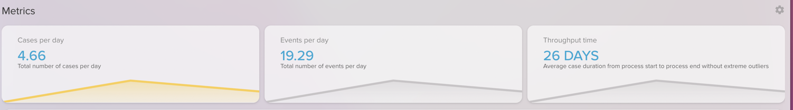
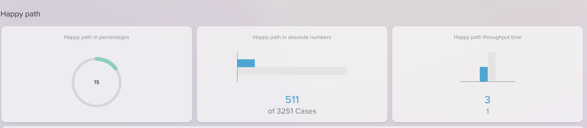
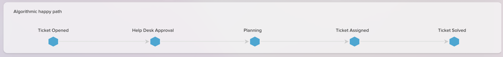
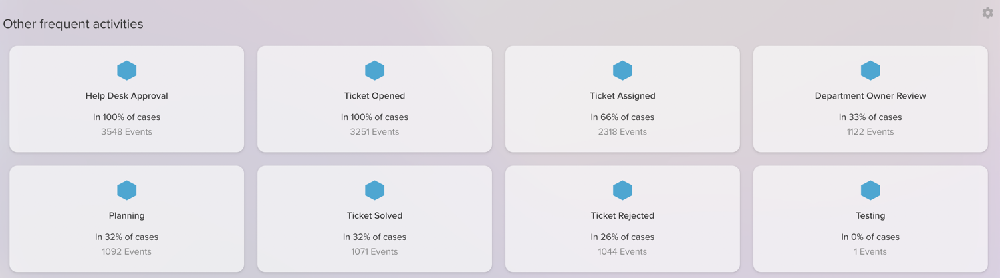

# Procetra Nedir?

Procetra, iş süreçlerinde yer alan olay kayıtlarını (event log) analiz ederek süreçlerinizi derinlemesine analiz etmenizi sağlayan; süreçlerinizle ilgili önemli iç görüler sunan, kullanımı kolay ve tamamen web tabanlı bir uygulamadır.

## Procetra Nasıl Kullanılır?

1. **Peda360** platformuna giriş yapıldıktan sonra platformun giriş sayfasında yer alan **Procetra** ikonu tıklanır. Procetra giriş ekranı görüntülenir. Bu sayfada sol tarafta Proje Oluşturma, Düzenleme ve Silme butonları yer almaktadır. Sol taraftaki menü listesinde en üstte yer alan **Yeni Proje** butonuna tıklanır.

2. Yeni Proje butonuna tıklandığında açılan pop-up'da **Proje Adı** yazılarak OK tuşu tıklanır. Bu şekilde yeni bir proje kaydedilmiş olur. Procetra ile süreç analizi yapmadan önce bir proje oluşturulmalıdır. 

3.Proje kaydedildikten sonra süreç verilerinin içeri yükleneceği **Process Overview** sayfası otomatik olarak görüntülenecektir. Burada süreç verileri hangi metotla içeri yüklenecekse o yöntem seçilir. Örneğin süreç verilerinin .csv formatında masasüstünde bulunduğu varsayılsın. Bu durumda **Upload Data** butonu tıklanır.

**Upload Data** butonu tıklanarak süreç olay kayıtlarının içeri yükleneceği ekran açılır. Burada **Drop File Here** yazan kutucuğa .csv dosyası sürükle bırak ile getirilebilir ya da **Browse Files** linki tıklanarak dosyanın masaüstünden seçilip yüklenmesi sağlanır.

Veriler içeri yüklendikten sonra süreç madenciliği kuralları gereği yüklenen .csv dosyasındaki verilerin Procetra'nın istediği alanlarla eşleştirilmiş olması gerekmektedir. Bu alanlar sırası ile;

* Case Id ( Süreç Id)
* Activity ( Faaliyet adı)
* Resource ( Kaynak-Zorunlu Değil)
* Start Timestamp ( Faaliyetin Başlangıç Tarihi)
* End Timestamp (Faaliyetin Bitiş Tarihi)

Veriler yüklendikten sonra ilgili sutunların üst kısmındaki kutucuklardan csv dosyasındaki başlığın **Procetra**'daki hangi alana denk geldiği belirtilir.

Tüm adımlar doğru gerçekleştirildiği takdirde herhangi bir hata bulunmuyorsa **Start Upload** butonu tıklanarak veriler **Procetra** veritabanına aktarılır ve analizler gerçekleştirilir.

## PROCESS OVERVIEW

**Procetra** ile süreç verilerinizi içeri aktardıktan sonra proje ana sayfasında yer alan kutucuklardan **Process Overview** kutucuğuna tıklayarak süreçlerinizle ilgili bir bakışta kritik analizlere ulaşabilirsiniz.

### Process Metrics

Procetra ile süreçlerinize ait ortalama günlük gerçekleşen süreç sayısı, günde gerçekleşen ortalama faaliyet sayısı ve süreçlerin ortalama tamamlanma sürelerini görebilirsiniz.

### Happy Paths

Procetra ile Happy Path analizleri gerçekleştirebilirsiniz. **Happy Path** bir sürecin en verimli ve en az hata üreten akışını belirten bir kavramdır. Procetra mevcut süreç kayıtlarınızı analiz ederek hangi akışın **Happy Path** olduğunu bulur ve analiz eder.

### Frekans Dağılımı

Procetra süreç kayıtlarınızı analiz ederek hangi faaliyetlerin ne sıklıkla gerçekleştiğini ve bunların sürecin genelinin ne kadarını oluşturduğunu oransal olarak gösterir.

