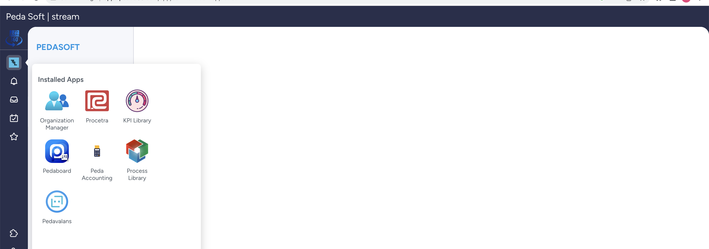

# Procetra Nedir?

Procetra, iş süreçlerinde yer alan olay kayıtlarını (event log) analiz ederek süreçlerinizi derinlemesine analiz etmenizi sağlayan; süreçlerinizle ilgili önemli iç görüler sunan, kullanımı kolay ve tamamen web tabanlı bir uygulamadır.

# Procetra ile Neler Yapabilirsiniz?

Procetra ile kurumsal iş uygulamalarınızdan elde ettiğiniz olay kayıtlarını uygulamaya yükleyerek süreçlerinizin gerçekte nasıl yürüdüğünü görebilir; süreç istatistiklerini analiz edebilir, süreç darboğazlarını tespit edebilir ve BPMN formatında süreç modellerinizi import ederek mevcut süreç modellerinizin gerçekteki akışlarla ne derece uyumlu olduğunu görebilirsiniz.

# Procetra'ya Nasıl Giriş Yaparım=

https://peda360.realmocean.app adresine giriş yapılır. Açılan sayfada kullanıcı adınızı ve şifrenizi girerek **Peda360** platformuna erişirsiniz.
**Peda360** platformuna giriş yapıldıktan sonra sol alt köşede yer alan grid ikonu tıklanır. Açılan uygulama menüsünde **Procetra** ikonu seçilir. **Procetra** anasayfası boş bir şekilde açılacaktır.

