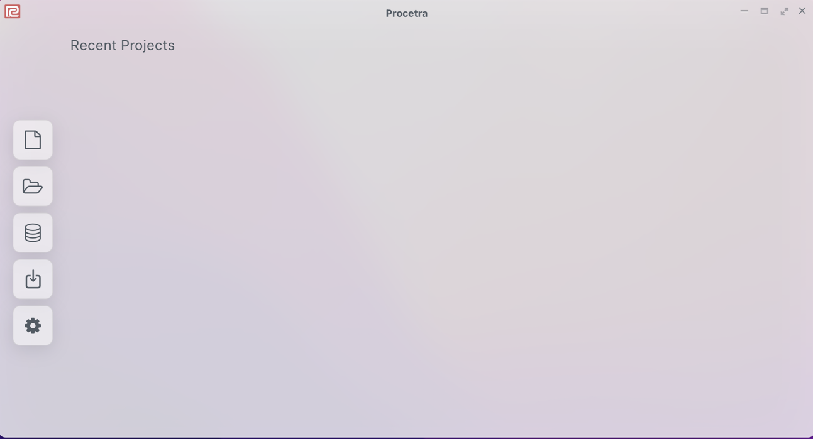
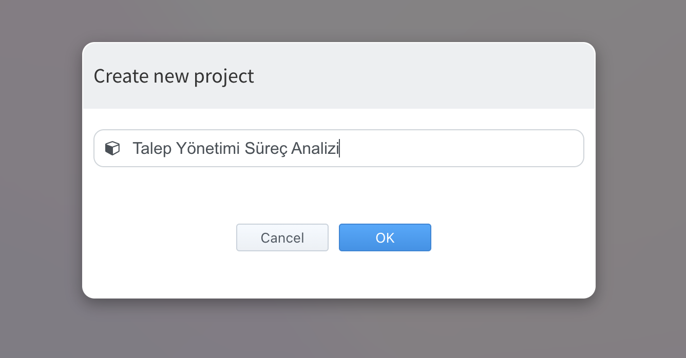

# Procetra Nedir?

Procetra, iş süreçlerinde yer alan olay kayıtlarını (event log) analiz ederek süreçlerinizi derinlemesine analiz etmenizi sağlayan; süreçlerinizle ilgili önemli iç görüler sunan, kullanımı kolay ve tamamen web tabanlı bir uygulamadır.

## Procetra Nasıl Kullanılır?

1. **Peda360** platformuna giriş yapıldıktan sonra platformun giriş sayfasında yer alan **Procetra** ikonu tıklanır. Procetra giriş ekranı görüntülenir. Bu sayfada sol tarafta Proje Oluşturma, Düzenleme ve Silme butonları yer almaktadır. Sol taraftaki menü listesinde en üstte yer alan **Yeni Proje** butonuna tıklanır.

2. Yeni Proje butonuna tıklandığında açılan pop-up'da **Proje Adı** yazılarak OK tuşu tıklanır. Bu şekilde yeni bir proje kaydedilmiş olur. Procetra ile süreç analizi yapmadan önce bir proje oluşturulmalıdır. 

3.Proje kaydedildikten sonra süreç verilerinin içeri yükleneceği **Process Overview** sayfası otomatik olarak görüntülenecektir. Burada süreç verileri hangi metotla içeri yüklenecekse o yöntem seçilir. Örneğin süreç verilerinin .csv formatında masasüstünde bulunduğu varsayılsın. Bu durumda **Upload Data** butonu tıklanır.

